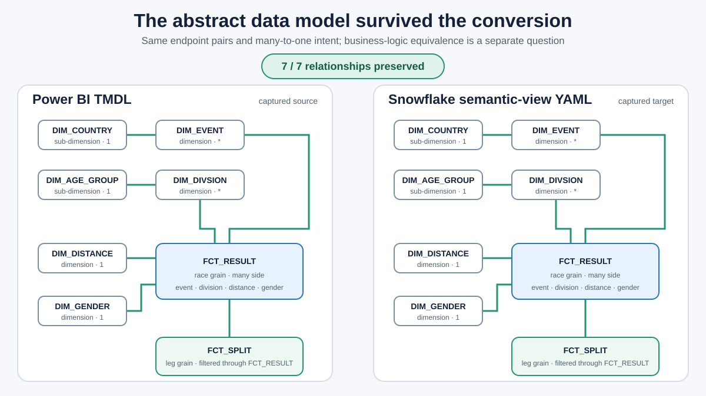
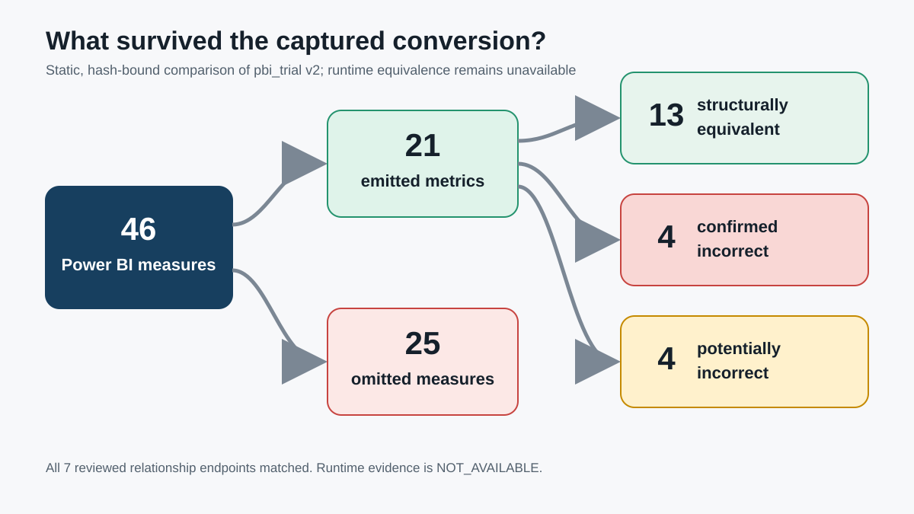
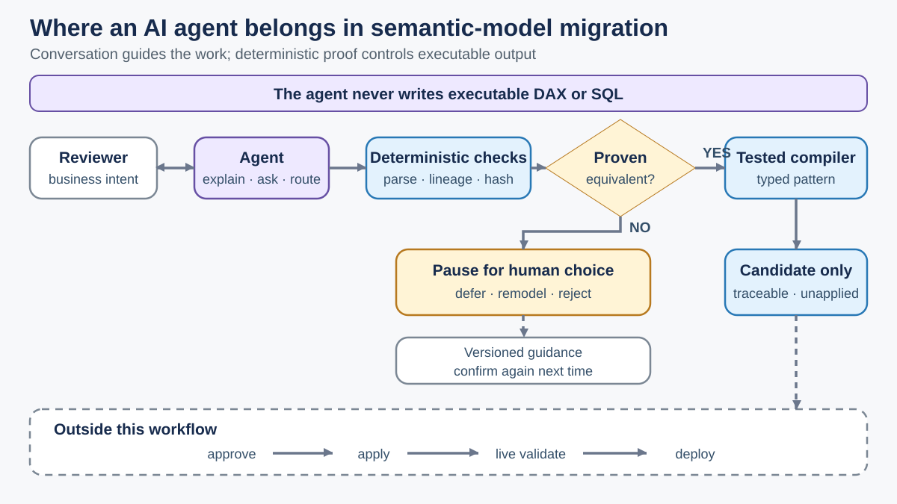

# Evidence and claim map

## Captured conversion problem

Source artifact: `pbit/pbi_trial.pbit`  
Portable audit fixture: `semantic_poc/benchmark/pbi_trial_v2/fixtures/`  
Captured target: `pbit/snowflake_semantic_view/pbi_trial.yaml`

Reproduce:

```text
python semantic_poc/run_pbi_trial_v2_audit.py --check --json
```

The hash-bound static audit reports:

- 46 Power BI measures.
- 21 emitted Snowflake metrics and 25 omissions.
- 13 structurally equivalent emitted metrics.
- Four confirmed mistranslations and four potentially incorrect translations.
- Seven of seven reviewed relationship endpoints matched.
- Runtime evidence: `NOT_AVAILABLE`.

### What the abstract conversion preserved

A direct endpoint comparison shows that all seven Power BI relationships are
present in the Snowflake YAML as `many_to_one` relationships. The normalized
country/event and age-group/division chains remain, and `FCT_SPLIT` remains
connected through `FCT_RESULT`.



The detailed endpoint table is in
[the relationship comparison](article-assets/relationship-comparison.md).
This supports the narrow statement that Snowflake captured the relationship
topology fairly well. It does not establish complete model, measure, or runtime
equivalence.

### Where business meaning was lost

The two main article examples are `Result Rows` and `Split Coverage Rate`.
The captured conversion omitted the straightforward result-grain count:

```text
Result Rows = COUNTROWS(FCT_RESULT)
```

It emitted the coverage rate with a different denominator:

```text
Power BI:
DIVIDE([Results With Splits], [Result Rows])

Captured Snowflake metric:
COUNT(DISTINCT FCT_SPLIT.RESULT_ID) / COUNT(*)
```

The Power BI denominator counts race results. In the captured Snowflake metric,
`COUNT(*)` is evaluated on `FCT_SPLIT`, so the denominator moved from result
grain to split grain.

Other omissions show the range of context that was not preserved in this
captured output: `Median Complete SBR Seconds` uses a filtered iterator,
`Distance Rank by Valid SBR` depends on visual scope and ranking, and
`Complete Five-Split Results` validates completeness across result and split
grain. These examples do not establish that Snowflake can never implement the
calculations.

The intentional `NC - Bike Time Hours Divisor 60` defect remains supporting
evidence rather than a main article example. It stayed active with cautionary
prose and was not proven caught.



## Agent-led maintenance evidence



`python semantic_poc/run_agent_guided_conversion_demo.py --clean --check`
proves a bounded offline interaction:

- all proposal-only tools remain repository-owned;
- `ISCROSSFILTERED`, `ISINSCOPE`, and inactive `USERELATIONSHIP` semantics are
  flagged as `MANUAL_REVIEW_REQUIRED`;
- unsafe dependency status propagates to dependent measures;
- the session pauses with deterministic answer references;
- only a reviewer-supplied answer on resume records a governed decision;
- unsupported findings emit no model-authored DAX or Snowflake SQL;
- supported create/update candidates still come from tested compilers.

Accepted review memory is exact, versioned, evidence-backed, and
confirmation-required. It is not model training or permission to apply a
future change.

The diagram is an authority model for the scripted workflow, not evidence of
provider-backed agent reliability. The captured audit separately proves only
that this captured output was unsafe to accept blindly; it does not prove that
every Snowflake conversion fails.

## Proposed assurance workflow

The other three commands use separate deterministic fixtures:

```text
python semantic_poc/run_demo.py --clean --check
python semantic_poc/run_agent_guided_conversion_demo.py --clean --check
python semantic_poc/run_end_to_end_demo.py --clean --check
```

They demonstrate an explicit review blocker, a scripted agent selecting bounded
tools, accepted review memory that still requires confirmation, corrected
fixture equivalence, synchronized target-candidate regeneration, source
immutability, and no deployment.

## Provenance

`PUBLIC_PROVENANCE.json` binds every exported file to the private source commit,
records protected source hashes, and describes the public-only sanitization of
the `.pbit` and one historical command string. The guided-sync golden bundle is
regenerated offline from the sanitized public projection rather than copied
from private ignored runtime state. Release artifacts must have
`private_source_dirty: false` and `local_review_only: false`.
